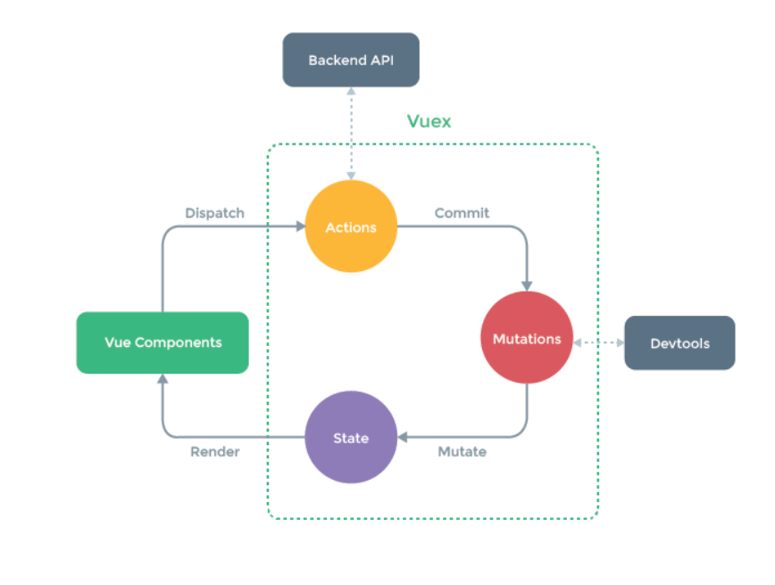
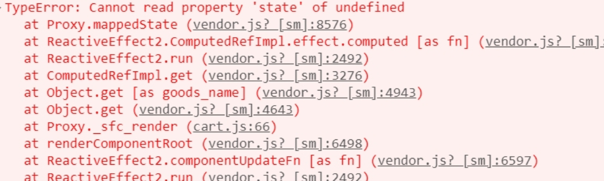

# 什么是uni-app？

`Uniapp` 是一个使用 `Vue.js` 作为开发语言的跨平台应用程序开发框架。它的主要特点是可以让开发者编写一套代码，然后在多个平台上发布，支持的平台包括但不限于
`Android`、`iOS`、`Web`、以及各种小程序（如微信小程序、支付宝小程序等）

`Uniapp` **的优势包括：**

1. 统一的开发体验：由于基于 `Vue.js`，开发者可以享受到一致的开发体验，无需为不同平台学习多种编程语言。
2. 代码复用：开发者只需要维护一套代码，就可以在多个平台上运行，减少了开发时间和成本。
3. 广泛的平台支持：除了移动操作系统外，`Uniapp` 还支持小程序生态，使得开发的应用能够覆盖更多的用户群体。
4. 丰富的组件库：提供了大量的 UI 组件，方便开发者快速构建界面。
5. 插件扩展性：支持插件机制，可以方便地集成第三方服务或者功能模块。
6. 自动生成多平台代码：能够根据开发者的设定，自动生成适用于不同平台的应用程序代码。

**应用场景：**
- 移动应用开发：开发 iOS 和 Android 应用程序。
- 小程序开发：开发微信小程序、支付宝小程序等。
- Web 应用：开发响应式的网页应用。
- 企业内部工具：快速构建企业内部使用的工具或管理系统。

## 一，使用`HbuilderX`构建第一个应用

1. 下载开发工具 `HbuilderX`

> `HbuilderX` 是通用的的前端开发工具，但是为了`uni-app` 做了特别强化。
>
> 下载标准版 并安装`uni-app`插件。

2. 创建 `uni-app` 项目

> 选择 `uni-app` 类型，输入工程名，选择模板，点击创建，即可成功创建。
>
> `uni-app` 自带的模板有 Hello `uni-app`，是官方的组件和`API`示例。
>
> 还有一个重要的模板是 `uni ui` 项目模板，日常开发推荐使用该模板，已内置大量常用组件。

3. 运行 `uni-app`

> 主要包括：浏览器运行，真机运行，小程序运行等。

4. 发布 `uni-app`

> 主要包括：云端原生`APP`，离线原生 `App`, `H5`, 各种小程序。

```
（1）工程目录结构
-components　uni-app组件目录
   -comp-a.vue　可复用的a组件
-hybrid　存放本地网页的目录（自建）
-platforms　存放各平台专用页面的目录（自建）
-pages　业务页面文件存放的目录
   -index　index.vue 
   -list　list.vue
-static　存放应用引用静态资源（如图片、视频等）的目录，注意：静态资源只能存放于此
-wxcomponents　存放小程序组件的目录（自建）
-common　公共资源（自建）
-api　请求封装（自建）
-store　状态管理（自建）
-main.js　Vue初始化入口文件
-App.vue　应用配置，用来配置App全局样式以及监听 应用生命周期
-manifest.json　配置应用名称、appid、logo、版本等打包信息
-pages.json　配置页面路由、导航条、选项卡等页面类信息
```

## 二，基础项目配置

1. **应用配置 manifest.json**

> manifest.json 文件是应用的配置文件，用于指定应用的名称，图标，权限等。我们也可以在这里为Vue为H5 设置跨域拦截处理器。

2. **编译配置 vue.config.js**

> vue.config.js 是一个可选的配置文件，如果项目的根目录中存在这个文件，那么它会被自动加载，一般用于配置webpack 等编译选项。

3. **全局配置 pages.json**

> pages.json 文件用来对 uni-app 进行全局配置，决定页面文件的路径，窗口样式，原生的导航栏，底部的原生tabbar 等。它类似于微信小程序中的
> app.json 的页面管理部分。

| globalStyle | Object        | 否  | 设置默认页面的窗口表现  |
|-------------|---------------|----|--------------|
| pages       | Object  Array | 是  | 设置页面路径以及窗口表现 |
| easycom     | Object        | 否  | 组件自动引入规则     |
| 属性          | 类型            | 必填 | 描述           |
| tabBar      | Object        | 否  | 设置底部tab的表现   |
| condition   | Object        | 否  | 启动模式配置       |
| subPackages | Object  Array | 否  | 分包加载配置       |
| preloadRule | Object        | 否  | 分包预下载规则      |

4. **全局样式 uni.scss**

> uni.scss 文件的用途是为了方便整体控制应用的风格，比如按钮颜色，边框风格，uni.scss 文件里面预置了一批scss变量预置。
>
> `uni-app` 官方扩展插件（uni ui）及 [插件市场](https://ext.dcloud.net.cn/) 上很多三方插件均使用了这些样式变量，如果你是插件开发者，建议你使用
> scss 预处理，并在插件代码中直接使用这些变量（无需 import 这个文件），方便用户通过搭积木的方式开发整体风格一致的App。
>
> `uni.scss`是一个特殊文件，在代码中无需 import
>
这个文件即可在scss代码中使用这里的样式变量。uni-app的编译器在webpack配置中特殊处理了这个uni.scss，使得每个scss文件都被注入这个uni.scss，达到全局可用的效果。如果开发者想要less、stylus的全局使用，需要在vue.config.js中自行配置webpack策略。

**注意：**

1. 如要使用这些常用变量，需要在 HBuilderX 里面安装 scss 插件；
2. 使用时需要在 style 节点上加上 `lang="scss"`。

```html

<style lang="scss">
</style>
```

3. pages.json不支持scss，原生导航栏和tabbar的动态修改只能使用js api

**以下是 uni.scss 的相关变量：**

```css
/* 颜色变量 */

/* 行为相关颜色 */
$
uni-color-primary: #007aff

;
$
uni-color-success: #4cd964

;
$
uni-color-warning: #f0ad4e

;
$
uni-color-error: #dd524d

;

/* 文字基本颜色 */
$
uni-text-color:#333

;
/
/
基本色
$ uni-text-color-inverse:#fff

;
/
/
反色
$ uni-text-color-grey:#999

;
/
/
辅助灰色，如加载更多的提示信息
$ uni-text-color-placeholder: #808080

;
$
uni-text-color-disable:#c0c0c0

;

/* 背景颜色 */
$
uni-bg-color:#ffffff

;
$
uni-bg-color-grey:#f8f8f8

;
$
uni-bg-color-hover:#f1f1f1

;
/
/
点击状态颜色
$ uni-bg-color-mask:rgba(0, 0, 0, 0.4)

;
/
/
遮罩颜色

/* 边框颜色 */
$ uni-border-color:#c8c7cc

;

/* 尺寸变量 */

/* 文字尺寸 */
$
uni-font-size-sm:

24
rpx

;
$
uni-font-size-base:

28
rpx

;
$
uni-font-size-lg:

32
rpx

;

/* 图片尺寸 */
$
uni-img-size-sm:

40
rpx

;
$
uni-img-size-base:

52
rpx

;
$
uni-img-size-lg:

80
rpx

;

/* Border Radius */
$
uni-border-radius-sm:

4
rpx

;
$
uni-border-radius-base:

6
rpx

;
$
uni-border-radius-lg:

12
rpx

;
$
uni-border-radius-circle:

50
%
;

/* 水平间距 */
$
uni-spacing-row-sm:

10
px

;
$
uni-spacing-row-base:

20
rpx

;
$
uni-spacing-row-lg:

30
rpx

;

/* 垂直间距 */
$
uni-spacing-col-sm:

8
rpx

;
$
uni-spacing-col-base:

16
rpx

;
$
uni-spacing-col-lg:

24
rpx

;

/* 透明度 */
$
uni-opacity-disabled:

0.3
;
/
/
组件禁用态的透明度

/* 文章场景相关 */
$ uni-color-title: #2C405A

;
/
/
文章标题颜色
$ uni-font-size-title:

40
rpx

;
$
uni-color-subtitle: #555555

;
/
/
二级标题颜色
$ uni-font-size-subtitle:

36
rpx

;
$
uni-color-paragraph: #3F536E

;
/
/
文章段落颜色
$ uni-font-size-paragraph:

30
rpx

;
```

5. **主组件 App.vue**

> `App.vue/uvue`是uni-app的主组件。uni-app js引擎版是app.vue。uni-app x是app.uvue。以下出现的`app.vue`一般泛指包含了`
> app.uvue
>
> 所有页面都是在`App.vue`下进行切换的，是应用入口文件。但`App.vue`本身不是页面，这里不能编写视图元素，也就是没有
`<template>`。
>
> 这个文件的作用包括：监听应用生命周期、配置全局样式、配置全局的存储globalData
>
> 应用生命周期仅可在`App.vue`中监听，在页面监听无效。

6. **入口文件 main.js**

> `main.js/uts`是 uni-app 的入口文件。uni-app js引擎版是`main.js`，而uni-app x则是`main.uts`。以下一般用`main.js`泛指全部。
>
> `main.js`主要作用是初始化`vue`实例、定义全局组件、使用需要的插件如 i18n、vuex。
>
> 首先引入了`Vue`库和`App.vue`，创建了一个`vue`实例，并且挂载`vue`实例。

```js
// uni-app vue2
import Vue from 'vue'
import App from './App'
import PageHead from './components/page-head.vue' //全局引用 page-head 组件

Vue.config.productionTip = false
Vue.component('page-head', PageHead) //全局注册 page-head 组件，每个页面将可以直接使用该组件
App.mpType = 'app'

const app = new Vue({
    ...App
})
app.$mount() //挂载 Vue 实例
```

```js
// uni-app vue3
import App from './App'
import {createSSRApp} from 'vue'
import PageHead from './components/page-head.vue' //全局引用 page-head 组件

export function createApp() {
    const app = createSSRApp(App)
    app.component('page-head', PageHead) //全局注册 page-head 组件，每个页面将可以直接使用该组件

    return {
        app
    }
}
```

```js
// uni-app (main.uts)
import App from './App'
import {createSSRApp} from 'vue'
import PageHead from './components/page-head.vue' //全局引用 page-head 组件

export function createApp() {
    const app = createSSRApp(App)
    app.component('page-head', PageHead) //全局注册 page-head 组件，每个页面将可以直接使用该组件

    return {
        app
    }
}
```

一般情况下，使用easycom比全局组件更常用，easycom按需应用更节省资源。

**代码时序**

> 开发者写的代码，在应用启动时，按如下时序加载：
>
> 1. main.js/uts 的 `export function createApp() {}` 外的代码、任何页面/组件的script中`export default {}`外的代码
> 2. main.js/uts 的 `export function createApp() {}` 中的代码
> 3. app.vue/uvue中onLaunch的代码
> 4. 首页的onLoad
> 5. 首页的onReady
>
> 开发者需谨慎在main.js/uts、页面/组件script中`export default {}`外、和onLaunch中编写代码：
>
> 1. 这些的代码都会影响启动速度（定义type不会，type是使用时才加载）
>
> 2. 执行太早，很多功能和API无法使用，需trycatch。尤其是与界面相关的都无法使用，此时首页都还没有创建。
>
> 3. main.js/uts、页面script中`export default {}`外的代码，其创建的变量在应用存活时一直占据着内存，不会跟随页面关闭而回收
     >
     >    **插件**

> 使用`Vue.use`引用插件，使用`Vue.prototype`添加全局变量，使用`Vue.component`注册全局组件。
>
> 可以引用`vuex`，因涉及多个文件，此处没有提供示例，详见`hello uni-app`示例工程。
>
> 无法使用`vue-router`，路由须在`pages.json`中进行配置。如果开发者坚持使用`vue-router`
> ，可以在[插件市场](https://ext.dcloud.net.cn/search?q=vue-router)找到转换插件。

**注意**

- nvue 暂不支持在 main.js 注册全局组件
- uni-app x 暂不支持 i18n、vuex、pinia等插件

## 三，Uniapp 生命周期

### 应用生命周期

`uni-app` 支持如下应用生命周期函数：

| 函数名                  | 说明                                                                                                                                                        | 平台兼容                  |
|:---------------------|:----------------------------------------------------------------------------------------------------------------------------------------------------------|:----------------------|
| onLaunch             | 当`uni-app` 初始化完成时触发（全局只触发一次），参数为应用启动参数，同 [uni.getLaunchOptionsSync](https://uniapp.dcloud.net.cn/api/getLaunchOptionsSync.html#getlaunchoptionssync) 的返回值 |                       |
| onShow               | 当 `uni-app` 启动，或从后台进入前台显示，参数为应用启动参数，同 [uni.getLaunchOptionsSync](https://uniapp.dcloud.net.cn/api/getLaunchOptionsSync.html#getlaunchoptionssync) 的返回值    |                       |
| onHide               | 当 `uni-app` 从前台进入后台                                                                                                                                       |                       |
| onError              | 当 `uni-app` 报错时触发                                                                                                                                         | app-uvue 不支持          |
| onUniNViewMessage    | 对 `nvue` 页面发送的数据进行监听，可参考 [nvue 向 vue 通讯](https://uniapp.dcloud.io/tutorial/nvue-api?id=communication)                                                     | app-uvue 不支持          |
| onUnhandledRejection | 对未处理的 Promise 拒绝事件监听函数（2.8.1+ app-uvue 暂不支持）                                                                                                              | app-uvue 不支持          |
| onPageNotFound       | 页面不存在监听函数                                                                                                                                                 | app-uvue 不支持          |
| onThemeChange        | 监听系统主题变化                                                                                                                                                  | app-uvue 不支持          |
| onLastPageBackPress  | 最后一个页面按下Android back键，常用于自定义退出                                                                                                                            | app-uvue-android 3.9+ |
| onExit               | 监听应用退出                                                                                                                                                    | app-uvue-android 3.9+ |

**示例代码**

```html

<script>
    // 只能在App.vue里监听应用的生命周期
    export default {
        onLaunch: function (options) {
            console.log('App Launch')
            console.log('应用启动路径：', options.path)
        },
        onShow: function (options) {
            console.log('App Show')
            console.log('应用启动路径：', options.path)
        },
        onHide: function () {
            console.log('App Hide')
        }
    }
</script>
```

**注意**

- **应用生命周期仅可在`App.vue`中监听，在其它页面监听无效**。
- 以组合式 API 使用时，在 Vue2 和 Vue3
  中存在一定区别，请分别参考：[Vue2 组合式 API 使用文档](https://zh.uniapp.dcloud.io/tutorial/vue-composition-api.html)
  和 [Vue3 组合式 API 使用文档](https://zh.uniapp.dcloud.io/tutorial/vue3-composition-api.html)。
- 应用启动参数，可以在API `uni.getLaunchOptionsSync`
  获取，[详见](https://uniapp.dcloud.net.cn/api/getLaunchOptionsSync.html#getlaunchoptionssync)
- onlaunch里进行页面跳转，如遇白屏报错，请参考https://ask.dcloud.net.cn/article/35942
- `App.vue` 不能写模板
- onPageNotFound 页面实际上已经打开了（比如通过分享卡片、小程序码）且发现页面不存在，才会触发，api 跳转不存在的页面不会触发（如
  uni.navigateTo）

### 页面生命周期

| 函数名                                 | 说明                                                                                                                                                                                          | 平台差异说明                                      | 最低版本   |
|:------------------------------------|:--------------------------------------------------------------------------------------------------------------------------------------------------------------------------------------------|:--------------------------------------------|:-------|
| onInit                              | 监听页面初始化，其参数同 onLoad 参数，为上个页面传递的数据，参数类型为 Object（用于页面传参），触发时机早于 onLoad                                                                                                                        | 百度小程序                                       | 3.1.0+ |
| onLoad                              | 监听页面加载，该钩子被调用时，响应式数据、计算属性、方法、侦听器、props、slots 已设置完成，其参数为上个页面传递的数据，参数类型为 Object（用于页面传参），参考[示例](https://zh.uniapp.dcloud.io/api/router#navigateto)。                                            |                                             |        |
| onShow                              | 监听页面显示，页面每次出现在屏幕上都触发，包括从下级页面点返回露出当前页面                                                                                                                                                       |                                             |        |
| onReady                             | 监听页面初次渲染完成，此时组件已挂载完成，DOM 树($el)已可用，注意如果渲染速度快，会在页面进入动画完成前触发                                                                                                                                  |                                             |        |
| onHide                              | 监听页面隐藏                                                                                                                                                                                      |                                             |        |
| onUnload                            | 监听页面卸载                                                                                                                                                                                      |                                             |        |
| onResize                            | 监听窗口尺寸变化                                                                                                                                                                                    | App、微信小程序、快手小程序                             |        |
| onPullDownRefresh                   | 监听用户下拉动作，一般用于下拉刷新，参考[示例](https://zh.uniapp.dcloud.io/api/ui/pulldown.html)                                                                                                                  |                                             |        |
| onReachBottom                       | 页面滚动到底部的事件（不是scroll-view滚到底），常用于下拉下一页数据。具体见下方注意事项                                                                                                                                           |                                             |        |
| onTabItemTap                        | 点击 tab 时触发，参数为Object，具体见下方注意事项                                                                                                                                                              | 微信小程序、QQ小程序、支付宝小程序、百度小程序、H5、App、快手小程序、京东小程序 |        |
| onShareAppMessage                   | 用户点击右上角分享                                                                                                                                                                                   | 微信小程序、QQ小程序、支付宝小程序、抖音小程序、飞书小程序、快手小程序、京东小程序  |        |
| onPageScroll                        | 监听页面滚动，参数为Object                                                                                                                                                                            | nvue不支持                                     |        |
| onNavigationBarButtonTap            | 监听原生标题栏按钮点击事件，参数为Object                                                                                                                                                                     | App、H5                                      |        |
| onBackPress                         | 监听页面返回，返回 event = {from:backbutton、 navigateBack} ，backbutton 表示来源是左上角返回按钮或 android 返回键；navigateBack表示来源是 uni.navigateBack；[详见](https://zh.uniapp.dcloud.io/tutorial/page.html#onbackpress) | app、H5、支付宝小程序                               |        |
| onNavigationBarSearchInputChanged   | 监听原生标题栏搜索输入框输入内容变化事件                                                                                                                                                                        | App、H5                                      | 1.6.0  |
| onNavigationBarSearchInputConfirmed | 监听原生标题栏搜索输入框搜索事件，用户点击软键盘上的“搜索”按钮时触发。                                                                                                                                                        | App、H5                                      | 1.6.0  |
| onNavigationBarSearchInputClicked   | 监听原生标题栏搜索输入框点击事件（pages.json 中的 searchInput 配置 disabled 为 true 时才会触发）                                                                                                                        | App、H5                                      | 1.6.0  |
| onShareTimeline                     | 监听用户点击右上角转发到朋友圈                                                                                                                                                                             | 微信小程序                                       | 2.8.1+ |
| onAddToFavorites                    | 监听用户点击右上角收藏                                                                                                                                                                                 | 微信小程序、QQ小程序                                 | 2.8.1+ |

## 四，Uniapp 路由配置及其页面跳转

### (1)  pages.json里面配置tabBar

> 如果应用是一个多 tab 应用，可以通过 tabBar 配置项指定一级导航栏，以及 tab 切换时显示的对应页。
>
> 在 pages.json 中提供 tabBar 配置，不仅仅是为了方便快速开发导航，更重要的是在App和小程序端提升性能。在这两个平台，底层原生引擎在启动时无需等待js引擎初始化，即可直接读取
> pages.json 中配置的 tabBar 信息，渲染原生tab。

> **Tips**
>
> - 当设置 position 为 top 时，将不会显示 icon
> - tabBar 中的 list 是一个数组，只能配置最少2个、最多5个 tab，tab 按数组的顺序排序。
> - tabbar 切换第一次加载时可能渲染不及时，可以在每个tabbar页面的onLoad生命周期里先弹出一个等待雪花（hello uni-app使用了此方式）
> - tabbar 的页面展现过一次后就保留在内存中，再次切换 tabbar 页面，只会触发每个页面的onShow，不会再触发onLoad。
> - 顶部的 tabbar 目前仅微信小程序上支持。需要用到顶部选项卡的话，建议不使用 tabbar 的顶部设置，而是自己做顶部选项卡，可参考
    hello uni-app->模板->顶部选项卡。

```json
// pages.json
{
  "pages": [
    //pages数组中第一项表示应用启动页，参考：https://uniapp.dcloud.io/collocation/pages
    {
      "path": "pages/index/index",
      "style": {
        "navigationBarTitleText": "首页",
        // 允许页面下拉
        "enablePullDownRefresh": true
      }
    },
    {
      "path": "pages/404/404",
      "style": {
        "navigationBarTitleText": "404",
        "enablePullDownRefresh": false
      }
    },
    {
      "path": "pages/list/list",
      "style": {
        "navigationBarTitleText": "通讯录"
      }
    },
    {
      "path": "pages/me/me",
      "style": {
        "navigationBarTitleText": "我的"
      }
    },
    {
      "path": "pages/friend/friend",
      "style": {
        "navigationBarTitleText": "发现"
      }
    }
  ],
  "globalStyle": {
    "navigationBarTextStyle": "black",
    "navigationBarTitleText": "uni-app",
    "navigationBarBackgroundColor": "#F8F8F8",
    "backgroundColor": "#F8F8F8"
  },
  "tabBar": {
    "color": "#7A7E83",
    "selectedColor": "#3cc51f",
    // 选中之后文字的颜色
    "borderStyle": "black",
    "backgroundColor": "#ffffff",
    "list": [
      {
        "pagePath": "pages/index/index",
        "iconPath": "static/wechat.png",
        "selectedIconPath": "static/wechat.png",
        // 选中之后的图标 选中之后的图标跟之前的不是同一个
        "text": "微信"
      },
      {
        "pagePath": "pages/list/list",
        "iconPath": "static/tongxun.png",
        "selectedIconPath": "static/tongxun.png",
        "text": "通讯录"
      },
      {
        "pagePath": "pages/friend/friend",
        "iconPath": "static/find.png",
        "selectedIconPath": "static/find.png",
        "text": "发现"
      },
      {
        "pagePath": "pages/me/me",
        "iconPath": "static/me.png",
        "selectedIconPath": "static/me.png",
        "text": "我的"
      }
    ]
  }
}
```

**属性说明：**

| 属性               | 类型       | 必填 | 默认值    | 描述                                                                                                                                                              | 平台差异说明                               |
|:-----------------|:---------|:---|:-------|:----------------------------------------------------------------------------------------------------------------------------------------------------------------|:-------------------------------------|
| color            | HexColor | 是  |        | tab 上的文字默认颜色                                                                                                                                                    |                                      |
| selectedColor    | HexColor | 是  |        | tab 上的文字选中时的颜色                                                                                                                                                  |                                      |
| backgroundColor  | HexColor | 是  |        | tab 的背景色                                                                                                                                                        |                                      |
| borderStyle      | String   | 否  | black  | tabbar 上边框的颜色，可选值 black/white，black对应颜色rgba(0,0,0,0.33)，white对应颜色rgba(255,255,255,0.33)。                                                                        | App 2.3.4+ 、H5 3.0.0+                |
| blurEffect       | String   | 否  | none   | iOS 高斯模糊效果，可选值 dark/extralight/light/none（参考:[使用说明](https://ask.dcloud.net.cn/article/36617)）                                                                   | App 2.4.0+ 支持、H5 3.0.0+（只有最新版浏览器才支持） |
| list             | Array    | 是  |        | tab 的列表，详见 list 属性说明，最少2个、最多5个 tab                                                                                                                              |                                      |
| position         | String   | 否  | bottom | 可选值 bottom、top                                                                                                                                                  | top 值仅微信小程序支持                        |
| fontSize         | String   | 否  | 10px   | 文字默认大小                                                                                                                                                          | App 2.3.4+、H5 3.0.0+                 |
| iconWidth        | String   | 否  | 24px   | 图标默认宽度（高度等比例缩放）                                                                                                                                                 | App 2.3.4+、H5 3.0.0+                 |
| spacing          | String   | 否  | 3px    | 图标和文字的间距                                                                                                                                                        | App 2.3.4+、H5 3.0.0+                 |
| height           | String   | 否  | 50px   | tabBar 默认高度                                                                                                                                                     | App 2.3.4+、H5 3.0.0+                 |
| midButton        | Object   | 否  |        | 中间按钮 仅在 list 项为偶数时有效                                                                                                                                            | App 2.3.4+、H5 3.0.0+                 |
| iconfontSrc      | String   | 否  |        | list设置 iconfont 属性时，需要指定字体文件路径                                                                                                                                  | App 3.4.4+、H5 3.5.3+                 |
| backgroundImage  | String   | 否  |        | 设置背景图片,优先级高于 backgroundColor                                                                                                                                    | App                                  |
| backgroundRepeat | String   | 否  |        | 设置标题栏的背景图平铺方式，可取值："repeat" - 背景图片在垂直方向和水平方向平铺；"repeat-x" - 背景图片在水平方向平铺，垂直方向拉伸；"repeat-y" - 背景图片在垂直方向平铺，水平方向拉伸；"no-repeat" - 背景图片在垂直方向和水平方向都拉伸。 默认使用 "no-repeat" | App                                  |
| redDotColor      | String   | 否  |        | tabbar上红点颜色                                                                                                                                                     | App                                  |

其中 list 接收一个数组，数组中的每个项都是一个对象，其属性值如下：

| 属性               | 类型      | 必填 | 说明                                                                             | 平台差异                       |
|:-----------------|:--------|:---|:-------------------------------------------------------------------------------|:---------------------------|
| pagePath         | String  | 是  | 页面路径，必须在 pages 中先定义                                                            |                            |
| text             | String  | 是  | tab 上按钮文字，在 App 和 H5 平台为非必填。例如中间可放一个没有文字的+号图标                                  |                            |
| iconPath         | String  | 否  | 图片路径，icon 大小限制为40kb，建议尺寸为 81px * 81px，当 position 为 top 时，此参数无效，不支持网络图片，不支持字体图标 |                            |
| selectedIconPath | String  | 否  | 选中时的图片路径，icon 大小限制为40kb，建议尺寸为 81px * 81px ，当 position 为 top 时，此参数无效            |                            |
| visible          | Boolean | 否  | 该项是否显示，默认显示                                                                    | App (3.2.10+)、H5 (3.2.10+) |
| iconfont         | Object  | 否  | 字体图标，优先级高于 iconPath                                                            | App（3.4.4+）、H5 (3.5.3+)    |

### (2) 路由跳转

> `uni-app` 有两种页面路由跳转方式：使用[navigator](https://zh.uniapp.dcloud.io/component/navigator)
> 组件跳转、调用[API](https://zh.uniapp.dcloud.io/api/router)跳转。

#### 页面栈

框架以栈的形式管理当前所有页面， 当发生路由切换的时候，页面栈的表现如下：

| 路由方式   | 页面栈表现               | 触发时机                                                                                                                                                    |
|--------|:--------------------|---------------------------------------------------------------------------------------------------------------------------------------------------------|
| 初始化    | 新页面入栈               | uni-app 打开的第一个页面                                                                                                                                        |
| 打开新页面  | 新页面入栈               | 调用 API  [uni.navigateTo](https://zh.uniapp.dcloud.io/api/router#navigateto) 、使用组件  <navigator open-type="navigate"/>                                    |
| 页面重定向  | 当前页面出栈，新页面入栈        | 调用 API  [uni.redirectTo](https://zh.uniapp.dcloud.io/api/router#redirectto) 、使用组件 <navigator open-type="redirectTo"/>                                   |
| 页面返回   | 页面不断出栈，直到目标返回页      | 调用 API  [uni.navigateBack](https://zh.uniapp.dcloud.io/api/router#navigateback)  、使用组件 <navigator open-type="navigateBack"/> 、用户按左上角返回按钮、安卓用户点击物理back按键 |
| Tab 切换 | 页面全部出栈，只留下新的 Tab 页面 | 调用 API  [uni.switchTab](https://zh.uniapp.dcloud.io/api/router#switchtab) 、使用组件 <navigator open-type="switchTab"/> 、用户切换 Tab                            |
| 重加载    | 页面全部出栈，只留下新的页面      | 调用 API  [uni.reLaunch](https://zh.uniapp.dcloud.io/api/router#relaunch) 、使用组件  <navigator open-type="reLaunch"/>                                        |

### (3)  获取当前页面栈

> `getCurrentPages()` 函数用于获取当前页面栈的实例，以数组形式按栈的顺序给出，第一个元素为首页，最后一个元素为当前页面。
>
> **注意：** `getCurrentPages()`仅用于展示页面栈的情况，请勿修改页面栈，以免造成页面状态错误。

### (4) 路由传参与接收

> 说明：页面生命周期的onLoad() 监听页面加载。其参数为上个页面传递的数据，如

```js
// 页面跳转并传递参数
uni.navigateTo({
    url: 'page/index/index?name=zheguo&message=hello'
})
```

**navigateTo(object)参数说明**

| 参数                | 类型       | 必填 | 默认值    | 说明                                                                                                                                       | 平台差异说明 |
|:------------------|:---------|:---|:-------|:-----------------------------------------------------------------------------------------------------------------------------------------|:-------|
| url               | String   | 是  |        | 需要跳转的应用内非 tabBar 的页面的路径 , 路径后可以带参数。参数与路径之间使用?分隔，参数键与参数值用=相连，不同参数用&分隔；如 'path?key=value&key2=value2'，path为下一个页面的路径，下一个页面的onLoad函数可得到传递的参数 |        |
| animationType     | String   | 否  | pop-in | 窗口显示的动画效果，详见：[窗口动画](https://zh.uniapp.dcloud.io/api/router.html#animation)                                                               | App    |
| animationDuration | Number   | 否  | 300    | 窗口动画持续时间，单位为 ms                                                                                                                          | App    |
| events            | Object   | 否  |        | 页面间通信接口，用于监听被打开页面发送到当前页面的数据。2.8.9+ 开始支持。                                                                                                 |        |
| success           | Function | 否  |        | 接口调用成功的回调函数                                                                                                                              |        |
| fail              | Function | 否  |        | 接口调用失败的回调函数                                                                                                                              |        |
| complete          | Function | 否  |        | 接口调用结束的回调函数（调用成功、失败都会执行）                                                                                                                 |        |

```javascript
// 在test.vue页面接受参数
export default {
    onLoad: function (option) { //option为object类型，会序列化上个页面传递的参数
        console.log(option.id); //打印出上个页面传递的参数。
        console.log(option.name); //打印出上个页面传递的参数。
    }
}
```

> **注意**：url 有长度限制，太长的字符传递失败，并且不规范的字符格式也可能导致传递失败，所以对于复杂的参数建议使用
> encodeURL , decodeUPL 进行处理后传递。

### (5) 小程序路由分包配置

> 因为小程序有体积和加载资源限制，各家小程序平台提供了分包方式，优化小程序的下载和启动速度。所谓的主包，即放置默认启动页面及
> Tabbar 页面，而分包是根据 pages.json 的配置进行分包的。
>
> 在小程序启动时，默认会下载主包并启动主包内页面，当用户进入分包内某个页面时，会把对应分包自动下载起来，下载完成后再进行展示，此时终端页面会有等待提示。

```
"subPackages": [{
		"root": "subpages",
		"pages": [{
			"path": "subpages/news/news",
			"style": {
				"navigationBarTitleText": "新闻中心",
				"navigationBarBackgroundColor": "#007aff",
				"navigationBarTextStyle": "black",
				"backgroundColor": "#007aff"
			}
		}],
	}],
	"preloadRule": {
		"pages/index": {
			"network": "all",
			"packages": ["activities"]
		}
	},
```

## 五，Uniapp 常用基础组件

> 官网地址：[](https://zh.uniapp.dcloud.io/component/view.html)

## 六，Uniapp 常用api

> `uni-app`的 js API 由标准 ECMAScript 的 js API 和 uni 扩展 API 这两部分组成。
>
> 标准 ECMAScript 的 js 仅是最基础的 js。浏览器基于它扩展了 window、document、navigator 等对象。小程序也基于标准 js 扩展了各种
> wx.xx、my.xx、swan.xx 的 API。node 也扩展了 fs 等模块。
>
> uni-app 基于 ECMAScript 扩展了 uni 对象，并且 API 命名与小程序保持兼容
>
> `uni-app`的 js 代码，web 端运行于浏览器中。非 web 端（包含小程序和 App），Android 平台运行在 v8 引擎中，iOS 平台运行在 iOS
> 自带的 jscore 引擎中，都没有运行在浏览器或 webview 里。
>
> 非 web 端，虽然不支持 window、document、navigator 等浏览器的 js API，但也支持标准 ECMAScript。
>
> 请注意不要把浏览器里的 js 等价于标准 js。
>
> 所以 uni-app 的非web端，一样支持标准 js，支持 if、for 等语法，支持字符串、数字、时间、布尔值、数组、自定义对象等变量类型及各种处理方法。仅仅是不支持
> window、document、navigator 等浏览器专用对象。

## 七，Uniapp 自定义组件及通信

### (1) 自定义组件概念

> 组件是vue 技术中非常重要的部分，组件使得与 ui 相关的轮子可以方便的制造和共享，进而使得vue使用者的开发效率大幅上升，在项目的
> component 目录下存放组件，uni-app 只支持单文件组件（.vue 组件）
>
> 组件可以使用 全局注册 和 页面引入 两种方式进行使用，使用分为三步：
>
> 导入 import xx from 'xxx'
>
> 注册Vue.use('xx',xx)    components:{ xx }
>
> 使用<xx/>  或者  <xx></xx>

### (2) 父子组件通信

> 父传子
>
> 1. 父组件通过自定义属性箱子组件传递数据。
> 2. 子组件通过props接收父组件传递的数据

> 子传父
>
> 1. 父组件通过自定义事件标签箱子组件传递事件
> 2. 子组件通过触发父组件定义事件修改父组件数据

```js
// 定义全局事件 先在组件内部
onLoad()
{
    uni.$on('allConfig', data => {
        console.log("这是定义的一个全局事件");
        this.name = data
    })
}

// 在你要触发的组件内部
// 触发全局事件
uni.$emit('allConfig', '折果')
```

### (3) slot 数据分发与作用域插槽

> 1. 父组件通过调用子组件内部嵌套 html 内容作为 slot 分发给子组件。
> 2. 子组件通过 slot 标签上添加属性，向父组件通信数据，作用域插槽。

## 八 , Uniapp  Vuex全局状态管理

1. 概念

> Vuex 是一个专为 Vue.js 应用程序开发的状态管理模式。它采用集中式存储管理应用的所有组件的状态，并以相应的规则保证状态以一种可预测的方式发生变化。

2. 应用场景

> Vue多个组件需要共享状态和数据

3. 关键规则

> - state，存储状态数据
> - getter，从状态数据派生数据，相当于 state 的计算属性
> - mutation，存储用于同步更新状态数据的方法，默认传入的参数为 state
> - actions，存储用于异步更改状态数据，但不是直接更改，而是通过触发 mutation 方法实现，默认参数为 context
> - module，Vuex 模块化

4. 交互关系



### 问题

在这里我出现一个问题，找了半天😵😵



解决办法

```js
// 在store文件夹下面index.js文件
import Vuex from 'vuex'

const store = new Vuex.Store({
    state: {
        userName: '未登录用户'
    },
    mutations: {
        MLOGIN: (state, userName) => {
            state.userName = userName
        },
        MLOGOUT: (state, userName) => {
            state.userName = '退出状态'
        }
    },
    actions: {
        login: (context, userName) => {
            context.commit('MLOGIN', userName)
        },
        logout: (context) => {
            context.commit('MLOGOUT')
        }
    }
})

export default store

// 在main.js 里面
import App from './App'

// #ifndef VUE3
import Vue from 'vue'
import './uni.promisify.adaptor'

Vue.config.productionTip = false
App.mpType = 'app'
const app = new Vue({
    ...App
})
app.$mount()
// #endif

// 上面的不改 把store加在下面
// #ifdef VUE3
import {createSSRApp} from 'vue'
import store from '@/store/index.js'

export function createApp() {
    const app = createSSRApp(App)
    app.use(store)
    return {
        app
    }
}

// #endif
```

5. 使用方法

```vue

<template>
  <view>
    <text>通讯录</text>

    <view>
      {{userName}}
    </view>

    <view>
      <button @click="login('蜡笔小新')">登录</button>
      <button @click="logout">注册</button>
    </view>
  </view>
</template>

<script>
  // 在组件的script标签中导入
  import {
    mapState,
    mapGetters,
    mapMutations,
    mapActions
  } from 'vuex';

  export default {
    data() {
      return {}
    },
    computed: {
      ...mapState({
        userName: state => state.userName,
        // 其他需要的状态
      })
    },
    methods: {
      ...mapActions(['login', 'logout'])
    },
    mounted() {
    }
  }
</script>

<style>

</style>
```

## 九，运行环境和跨端兼容

### (1) 开发环境和生产环境

> uni-app 可通过 process.env.NODE_ENV 判断当前环境是开发环境还是生产环境，一般用于连接测试服务器或生产服务器的动态切换。
>
> 在HBuilderX 中，点击 运行 编译出来的代码是开发环境，点击 发行 编译出来的是生产环境。

### (2) 判断平台

> 平台判断有 2 种场景，一种是在编译期判断，一种是在运行期判断。

> 编译期判断
>
编译期判断，即条件编译，不同平台在编译出包后已经是不同的代码。详见：[条件编译](https://zh.uniapp.dcloud.io/tutorial/platform.html)

```javascript
// #ifdef H5
alert('只有h5平台才有alert方法');
// #endif
```

如上代码只会编译到 H5 的发行包里，其他平台的包不会包含如上代码。

> 运行期判断 运行期判断是指代码已经打入包中，仍然需要在运行期判断平台，此时可使用 `uni.getSystemInfoSync().platform`
> 判断客户端环境是 Android、iOS 还是小程序开发工具（在百度小程序开发工具、微信小程序开发工具、支付宝小程序开发工具中使用
`uni.getSystemInfoSync().platform` 返回值均为 devtools）。

```javascript
switch (uni.getSystemInfoSync().platform) {
    case 'android':
        console.log('运行Android上');
        break;
    case 'ios':
        console.log('运行iOS上');
        break;
    default:
        console.log('运行在开发者工具上');
        break;
}
```

如有必要，也可以在条件编译里自己定义一个变量，赋不同值。在后续运行代码中动态判断环境。

### (3) 跨端兼容

> uni-app 已将常用的组件、API封装到框架中，开发者按照 uni-app 规范开发即可保证多平台兼容，大部分业务均可直接满足。
>
> 但每个平台有自己的一些特性，因此会存在一些无法跨平台的情况。
>
> - 大量写 if else，会造成代码执行性能低下和管理混乱。
> - 编译到不同的工程后二次修改，会让后续升级变的很麻烦。
> - 为每个平台重写，明明主业务逻辑又一样
>
> 在 C 语言中，通过 `#ifdef`、`#ifndef` 的方式，为 Windows、Mac 等不同 OS 编译不同的代码。
>
> `uni-app` 团队参考这个思路，为 `uni-app` 提供了条件编译手段，在一个工程里优雅的完成了平台个性化实现。

> 条件编译是用特殊的注释作为标记，在编译时根据这些特殊的注释，将注释里面的代码编译到不同平台。
>
> 写法：
>
> 以 `#ifdef` 或 `#ifndef` 加 `%PLATFORM%` 开头，以 `#endif` 结尾。
>
> - `#ifdef`：if defined 仅在某平台存在
>
> - `#ifndef`：if not defined 除了某平台均存在
>
> - `%PLATFORM%`：平台名称
>


**`%PLATFORM%`** 可取值如下表所示：

| APP                     | App                                                                         |                  |
|-------------------------|-----------------------------------------------------------------------------|------------------|
| APP-PLUS                | uni-app js引擎版编译为App时                                                        |                  |
| APP-PLUS-NVUE或APP-NVUE  | App nvue 页面                                                                 |                  |
| APP-ANDROID             | App Android 平台 [详情](https://zh.uniapp.dcloud.io/tutorial/platform.html#uts) |                  |
| APP-IOS                 | App iOS 平台 [详情](https://zh.uniapp.dcloud.io/tutorial/platform.html#uts)     |                  |
| APP-HARMONY             | App HarmonyOS Next 平台                                                       |                  |
| H5                      | H5（推荐使用 `WEB`）                                                              |                  |
| WEB                     | web（同`H5`）                                                                  | HBuilderX 3.6.3+ |
| MP-WEIXIN               | 微信小程序                                                                       |                  |
| MP-ALIPAY               | 支付宝小程序                                                                      |                  |
| MP-BAIDU                | 百度小程序                                                                       |                  |
| MP-TOUTIAO              | 抖音小程序                                                                       |                  |
| MP-LARK                 | 飞书小程序                                                                       |                  |
| MP-QQ                   | QQ小程序                                                                       |                  |
| MP-KUAISHOU             | 快手小程序                                                                       |                  |
| MP-JD                   | 京东小程序                                                                       |                  |
| MP-360                  | 360小程序                                                                      |                  |
| MP                      | 微信小程序/支付宝小程序/百度小程序/抖音小程序/飞书小程序/QQ小程序/360小程序                                 |                  |
| QUICKAPP-WEBVIEW        | 快应用通用(包含联盟、华为)                                                              |                  |
| QUICKAPP-WEBVIEW-UNION  | 快应用联盟                                                                       |                  |
| QUICKAPP-WEBVIEW-HUAWEI | 快应用华为                                                                       |                  |

## Uniapp 社区论坛项目多端实战

